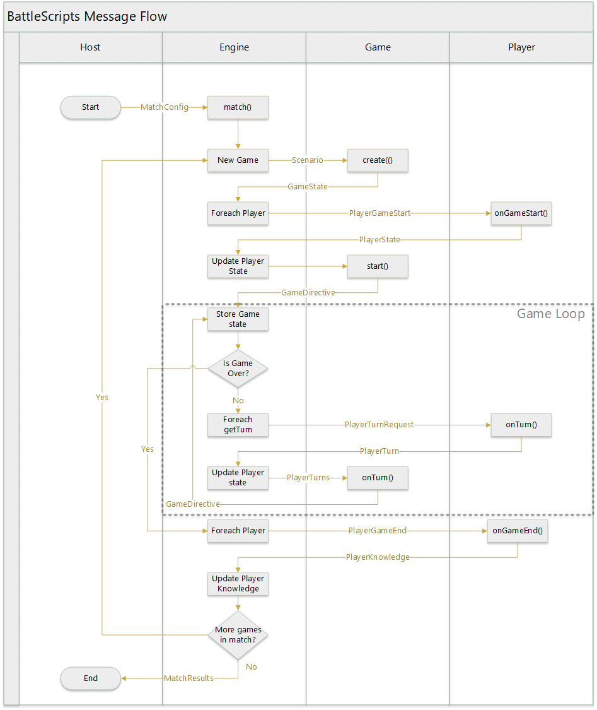

# BattleScripts

The functionality of BattleScripts is defined entirely by JSON messages. This is just one possible implementation of an Engine. Because orchestration is done entirely through JSON messages without any dependence on language or implementation, other Engines could be written in other languages which perform the same function.



## Engine Message Interfaces

#### MatchConfig

Passed into the Engine to instruct it to begin playing a match.

```
interface MatchConfig {
  game: Game,
  players: [ Player+ ],
  
  // Optional configuration options for the Game
  scenario?: Scenario,
  
  // Max number of loops to run through the Engine before error
  loopLimit?: Number,
  
  // Player timeouts in ms
  gameStartTimeout?: Number,
  turnTimeout?: Number,
  gameEndTimeout?: Number
}
```

#### MatchResults

Returned from the Engine. The results are an Array of results for each game. The state is an Array of games, each being an Array of individual game states.

````
interface MatchResults {
  results: [ GameResults* ],
  state: [ [ GameState* ] ]
}
````

#### MatchResultsSummary

The output of tally() takes raw results and computes a summary.

````
interface MatchResultsSummary {
  matchWinners: [ PlayerId* ],
  gameWinners: [ [ PlayerId* ] ],
  scores: [ Number* ],
}
````

## Engine <---> Game Message Interfaces

#### GameDirective

The Game returns this as the "command" to the Engine to control flow. This is the core of the Game's interaction with the Engine.

```
interface GameDirective {
  // Game returns state with every Directive.
  // It can be optionally rendered now or later.
  state: GameState,

  // Request that one or more players take a turn.
  // Pass each player a game state that is specific to them.
  getTurn?: {
    PlayerId: GameState
  },

  // Pass an arbitrary message to one or more players.
  message?: {
    PlayerId: GameMessage
  },

  // Return true if the game is over the loop should terminate  
  gameOver?: Boolean,
  
  // If gameOver==True, then results must be returned.
  results?: {
    // Each player will get an integer score with a game-defined max.
    // The highest score(s) is the winner(s)
    // The Game decides how many points to award.
    PlayerId: Number
  },
  
  // Info from the game, which might be displayed to the user in a UI.
  log?: String | [ String* ]
}
```

#### PlayerTurns

After requesting moves from players, the Engine passes this message to the Game to process the moves.

```
interface PlayerTurns {
  PlayerId: PlayerTurn
}
```

#### Opaque Types

These are game-defined types that may contain any data or structure as decided and documented by the Game being played.

```
type GameState;
type GameMessage;
type Move;
type Scenario;
````

## Engine <---> Player Message Directives

#### PlayerGameStart

Passed to the player when a game is ready to start. 

````
interface PlayerGameStart {
  gameState: GameState,
  knowledge?: PlayerKnowledge
}
````

#### PlayerTurnRequest

Passed to the Player when they are asked to take a turn.

````
interface PlayerTurnRequest {
  gameState: GameState,
  playerState: PlayerState
}
````

#### PlayerTurn

Passed from the Player to the Engine to take a turn. The playerState attribute is optional if the player wishes to persist state between turns.

````
interface PlayerTurn {
  move: Move,
  playerState?: PlayerState
}
````

#### PlayerGameEnd

Passed to the Player when the game is over to inform of the results.

````
interface PlayerGameEnd {
  results: GameResults,
  gameState: GameState,
  playerState: PlayerState
}
````

### Opaque Types

These are player-defined data structures. Knowledge is passed from the player to itself between games so it can change its behavior over multiple games. PlayerState is within a single game only, passed to each turn and optionally updated.

```
type PlayerKnowledge;
type PlayerState;
```

### Method API's

The Host environment is responsible for passing a Game and one or more Player objects to the Engine. The Engine is agnostic about how these objections function, as long as they satisfy the interfaces below.

```
interface Engine {
  match(MatchConfig): MatchResults,
  tally(MatchResults): MatchResultsSummary
}

interface Player {
  onGameStart(PlayerGameStart): PlayerState,
  onTurn(PlayerTurnRequest): PlayerTurn | Move,
  onMessage(GameMessage): PlayerState,
  onGameEnd(PlayerGameEnd): PlayerKnowledge?
}

interface Game {
  create(Scenario): GameState,
  start(): GameDirective,
  onTurn(PlayerTurns): GameDirective
}
```
